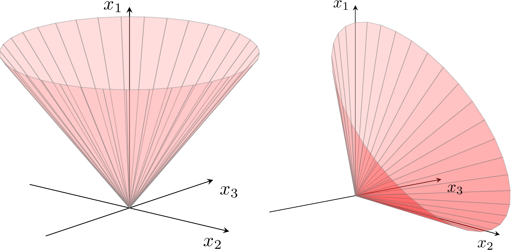

# Conic Linear Programming 锥线性规划

本部分看似和分布鲁棒优化没什么关系，但值得优先学习，原因将在最后揭晓。

## 二阶锥

二阶锥（second-order cone，又称ice-cream/Lorentz cone）的形式为：
$$Q^{n+1}=\{(t,x)\in R \times R^n:t\geq \Vert x\Vert_2\}$$ 
即：满足 $t\geq \Vert x\Vert_2$ 的所有 $(t,x)$ 。

$Q$ 的上标表示了它的维度。因 $t$ 为1维， $x$ 为 $n$ 维向量，故 $Q$ 为 $n+1$ 维。从几何的角度看，在 $x$ 为2维的情况下，二阶锥表示了一个圆锥上方的所有空间，所以也被称为“冰淇淋锥”。



## 非负象限锥

非负象限锥很简单，即 $R_+^n$ 。在2维的情况下，指的就是第一象限。

## 半正定锥

设 $S^n$ 为 $n\times n$ 的对称矩阵，则半正定锥（semidefinite cone）的形式为：
$$S_+^n=\{Y\in S^n:u^TYu\geq 0\quad \forall u\in \mathbb{R}^n \}$$ 
即：包含所有的 $n$ 阶对称半正定矩阵。

## 锥线性规划与线性规划的关系

为什么说锥线性规划是线性规划的拓展呢？回顾线性规划标准型：
$$\min \quad c^Tx$$

$$s.t \quad Ax=b$$

$$x\geq 0$$

（Github似乎不支持```align```语法，导致这些多行公式都无法对齐，不够优雅）

从锥规划的角度看， $x\geq0$ 实际上就是 $x\in R_+^n$ ！当我们把此处的非负象限锥 $R_+^n$ 改为二阶锥或者半正定锥，自然就从线性规划推广出了锥线性规划。假设我们把 $R_+^n$ 改成锥 $K$ ，那么锥规划写作：

$$\min \quad c^Tx$$

$$s.t \quad Ax=b$$

$$x\in K$$

为了看起来跟线性规划更像，我们把不等号也进行推广，定义： $x\succeq_K 0 \Leftrightarrow x\in K$，就得到了锥规划的“标准型”：

$$\min \quad c^Tx$$

$$s.t \quad Ax=b$$

$$x\succeq_K 0$$

如果“不等号”右边不是0，也是同样的道理：在非负象限锥下， $x\geq y \Leftrightarrow x-y\geq 0  \Leftrightarrow x-y\in R_+^n$ ；在锥 $K$ 下， $x\succeq_K y \Leftrightarrow x-y\succeq_K 0  \Leftrightarrow x-y\in K$ 。

注意到二阶锥中出现了 $x$ 的2范数，因此二阶锥规划实际上可以处理二次问题，适用范围比线性规划更广。

## 对偶锥

锥 $K$ 的对偶锥定义为：

$$K^*=\{y:\langle x,y\rangle\geq0 \quad \forall x\in K\}$$

其中 $\langle x,y\rangle$ 为 $x$ 与 $y$ 的内积。直观地看， $K^*$ 中的所有元素必须满足与 $K$ 中的所有元素的夹角不超过90°。显然，对于 $R_+^n$ ，其对偶锥就是它自己，这种对偶锥就是自己的锥叫做自对偶锥（self-dual cone）。除了非负象限锥之外，可以证明二阶锥、半正定锥都是对偶锥，所以它们在锥规划中发挥了重要作用。

## 锥线性规划的对偶问题

为了更加具有一般性，以后目标函数就用内积的形式写了。考虑原问题：

$$\min \quad \langle c,x\rangle$$

$$s.t \quad \langle a_i,x\rangle =b_i,\quad i=1,2,...,m$$

$$x\succeq_K 0$$

对等式约束引入拉格朗日乘子 $y_i$，得到拉格朗日函数： 

$$L(x,y)=\langle c,x\rangle -\sum_{i=1}^{m}y_i(\langle a_i,x\rangle-b_i) \\ = \sum_{i=1}^{m}b_i y_i+\langle c-\sum_{i=1}^{m}y_i a_i,x\rangle$$

设锥 $K$ 的对偶锥为 $K^{*}$ ，考虑 $\min_{x\in k} L(x,y)$ ，则当 $c-\sum y_i a_i\in K^{*}$ 时， $\min \langle c-\sum y_i a_i,x\rangle=0$ ，否则 $\min \langle c-\sum y_i a_i,x\rangle=-\infty$ 。因此，原问题的对偶问题为：

$$\max_y \quad \sum_{i=1}^{m}b_i y_i$$

$$s.t \quad c-\sum_{i=1}^{m}y_i a_i\in K^*$$

可以看出，锥线性规划对偶问题的推导也与线性规划对偶问题的推导十分相似。

## 强对偶性的成立条件

若原问题或对偶问题有界且存在严格可行解，则强对偶性成立。

（与线性规划强对偶性的成立条件相比，多了一个“严格可行”）

严格可行解指：对于原问题的可行解 $\bar{x}$ 或对偶问题的可行解 $\bar{y}$ ， $\exists \bar{x} \quad s.t \quad \bar{x}\in int(K)$ （原问题）或 $\exists \bar{y} \quad s.t \quad c-\sum\bar{y_i} a_i\in int(K^*)$ （对偶问题），其中 $int(K)$ 表示在锥 $K$ 的内部。

须注意：在锥线性规划中，若的原问题有界且存在严格可行解，则对偶问题有最优解；若对偶问题有界且存在严格可行解，则原问题有最优解。而在线性规划中，只要原问题或对偶问题有界且存在可行解，则原问题和对偶问题都有最优解。

## 应用

回顾鲁棒线性约束：

$$a^Tx \leq b \quad \forall (a,b)=(a_0,b_0)+\sum_{j=1}^{l} \xi_j(a_j,b_j), \quad \xi \in \mathcal{U}\subseteq R^l$$

当不确定集 $\mathcal{U}=\{y:\Vert y \Vert_2 \leq1\}$ 时，上述约束等价于：

$$\Vert [(a_j)^Tx-b_j]_j\Vert_2 \leq b_0-(a_0)^Tx$$

其实，它就是一个二阶锥约束！这也就是要在进一步学习分布鲁棒优化之前先学习锥线性规划的原因。我们费劲心思把一个优化写成线性规划、二阶锥规划或半正定规划问题，是因为它们都是比较“标准”的凸优化问题，求解方法非常成熟。


