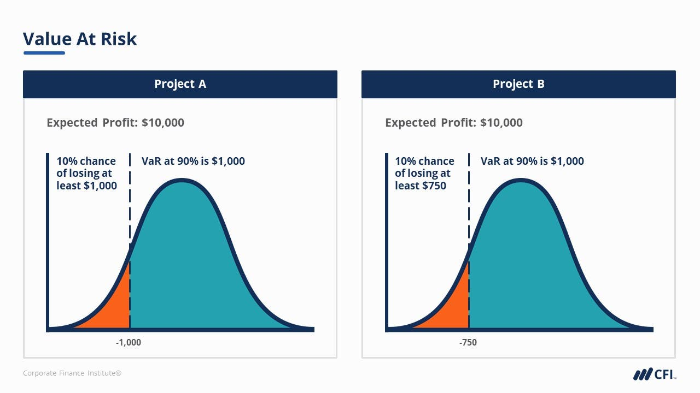

# Moment-based DRO 基于矩的分布鲁棒优化

## 从投资组合优化问题开始

考虑一个单周期投资组合优化问题。假设共有 $n$ 种资产， $x_i$ 为第 $i$ 种资产的回报（是随机的）， $w_i$ 为分配到第 $i$ 种资产的投资权重，则投资总汇报为 $w^Tx$ 。

一个非常著名的衡量投资风险的度量是在险价值（Value-at-Risk，VaR），其定义为：

$$VaR(w)=\inf\{r:P(r\leq-w^Tx)\leq \epsilon\}$$

即：使得投资损失超过 $r$ 的概率不超过 $\epsilon$ 的最小 $r$ 。

## 基于矩的模糊集

我们不知道 $x$ 的准确分布，但是我们可以得知关于准确分布的一些信息，尤其是一阶和二阶矩信息，比如均值 $\mu$ 和协方差 $\Gamma$ 。引入基于矩的模糊集 $\mathcal{P}$ ，考虑VaR的分布鲁棒模型DR-VaR：

<!-- $$
\begin{array}{ll}
\inf & r \\
s.t & \sup_{\mathbb{P} \in \mathcal{P}} P_{\mathbb{P}}(r\leq-w^Tx)\leq \epsilon
\end{array}
$$ --> 

其中， $\mathbb{P}$ 是 $x$ 的分布， $\mathcal{P}$ 是包含所有均值为 $\mu\in R^n$ 且方差为 $\Gamma \in S_n^{++}$ 的分布的集合。

## 分布鲁棒机会约束

上述DR-VaR问题中的约束是一个分布鲁棒机会约束（distributionally robust chance constrain, DRCC），含义是：即使在最差的分布 $\mathbb{P}$ 下，投资损失超过 $r$ 的概率也不超过 $\epsilon$ 。这一约束无法直接求解，需要进一步处理：

<!-- $$
\begin{array}{ll}
& \sup_{\mathbb{P} \in \mathcal{P}} \quad P_{\mathbb{P}}(r\leq-w^Tx) \\
= & \sup \quad \int_{R^n} \mathbb{I}_{\{r\leq-w^Tx\}}(x)d\mathbb{P}(x) \\
s.t & \int_{R^n}d\mathbb{P}(x)=1, \\
& \int_{R^n}xd\mathbb{P}(x)=\mu,\\
& \int_{R^n}(x-\mu)(x-\mu)^Td\mathbb{P}(x)=\Gamma, \\
& \mathbb{P}(x)\geq 0. \\
\end{array}
$$ --> 

其中 $\mathbb{I}_{\{A\}}$ 是指示函数，当事件A发生是取值为1，否则为0； $\mathbb{P}(x)$ 是决策变量。这个DRCC是关于 $\mathbb{P}(x)$ 的线性规划问题，前3个约束条件又可以合并写成：

<!-- $$
\quad \quad \int_{R^n}\begin{bmatrix}x \\ 1\end{bmatrix}\begin{bmatrix}x \\ 1\end{bmatrix}^Td\mathbb{P}(x)=\begin{bmatrix}\Gamma+\mu\mu^T & \mu \\ \mu^T& 1\end{bmatrix}=\Sigma\in S_{++}^{n+1}
$$ --> 

## 分布鲁棒机会约束的对偶问题

此时，这个DRCC依然难以求解。遇事不决，写对偶！对矩阵 $\Sigma$ 引入拉格朗日乘子 $M\in S^{n+1}$ ，考虑DRCC的拉格朗日函数：

<!-- $$
L(\mathbb{P},M)=\int_{R^n} \mathbb{I}_{\{r\leq-w^Tx\}}(x)d\mathbb{P}(x)+\langle M,\Sigma-\int_{R^n}\begin{bmatrix}x \\ 1\end{bmatrix}\begin{bmatrix}x \\ 1\end{bmatrix}^Td\mathbb{P}(x) \rangle
$$ --> 

<!-- $$
\begin{array}{ll}
& \sup_{\mathbb{P}\geq 0} L(\mathbb{P},M) \\ = & \langle M,\Sigma \rangle+\sup_{\mathbb{P}\geq0}\int_{R^n} [\mathbb{I}_{\{r\leq-w^Tx\}}(x)-\begin{bmatrix}x \\ 1\end{bmatrix}^TM\begin{bmatrix}x \\ 1\end{bmatrix}]d\mathbb{P}(x) \\
= & \sup_{\mathbb{P}\geq 0}\langle M,\Sigma \rangle \\
& s.t \quad \mathbb{I}_{\{r\leq-w^Tx\}}(x)\leq \begin{bmatrix}x \\ 1\end{bmatrix}^TM\begin{bmatrix}x \\ 1\end{bmatrix} \quad \forall x
\end{array}
$$ --> 

由于 $\forall x$ 的存在，此问题仍然包含了无穷多个约束。进一步地，对指示函数进行拆解，可得到以下两个条件：

<!-- $$
\begin{bmatrix}x \\ 1\end{bmatrix}^TM\begin{bmatrix}x \\ 1\end{bmatrix} \geq 0 \quad \forall x
$$ --> 

<!-- $$
\begin{bmatrix}x \\ 1\end{bmatrix}^TM\begin{bmatrix}x \\ 1\end{bmatrix} \geq 1 \quad \forall x:r\leq-w^Tx
$$ --> 

第一个条件直接等价于 $M \in S_+^{n+1}$ 。第二个条件可以等价地写作：

<!-- $$
1 \leq \inf \begin{bmatrix}x \\ 1\end{bmatrix}^TM\begin{bmatrix}x \\ 1\end{bmatrix}
$$ --> 

$$\quad s.t \quad r+w^Tx \leq 0$$

对不等式约束引入拉格朗日乘子 $\tau$ ，则第二个条件等价于：

$$\exists \tau \geq 0$$

<!-- $$
s.t \quad \begin{bmatrix}x \\ 1\end{bmatrix}^TM\begin{bmatrix}x \\ 1\end{bmatrix}+\tau(r+w^Tx) \geq 1 \quad \forall x \in R^n
$$ --> 

即：

$$\exists \tau \geq 0$$

<!-- $$
s.t \quad \begin{bmatrix}x \\ 1\end{bmatrix}^T(M+\begin{bmatrix}0 & -\frac{1}{2} \tau w \\ -\frac{1}{2} \tau w ^T & 1-\tau r\end{bmatrix})\begin{bmatrix}x \\ 1\end{bmatrix} \geq 0 \quad \forall x \in R^n
$$ --> 

所以，DRCC的对偶问题为：

<!-- $$
\begin{array}{ll}
& \inf_{M\in S^{n+1}} \sup_{\mathbb{P}\geq 0} \quad L(\mathbb{P},M) \\
= & \inf \quad \langle M,\Sigma \rangle \\
& s.t \quad M+\begin{bmatrix}0 & \frac{1}{2} \tau w \\ \frac{1}{2} \tau w ^T & \tau r-1\end{bmatrix} \in S_+^{n+1} \\
& \quad \quad M\in S_+^{n+1} \\
& \quad \quad \tau \geq 0 \\
\end{array}
$$ --> 

这个问题是一个半正定锥规划问题。另外可以证明，对于DRCC问题，强对偶性成立。至此，DR-VaR问题已经容易求解。

## 引入统计量的估计

前面的模糊集依赖于均值和方差的真实值，但实际上，很多时候我们只能对这些统计量进行估计。如果我们有随机变量的 $N$ 个独立同分布的样本 $\xi_i$ ，就可以引入均值和方差的估计量：

$$\hat{\mu}=\frac{1}{N} \sum_{i=1}^{N} \xi_i$$

$$\hat{\Gamma}=\frac{1}{N} \sum_{i=1}^{N} (\xi_i-\hat{\mu})(\xi_i-\hat{\mu})^T$$

为了在构建模糊集时考虑估计误差，我们可以考虑均值的估计量在一个以均值的真实值为中心的椭圆中：

$$(\mu-\hat{\mu})^T\hat{\Gamma}^{-1}(\mu-\hat{\mu})\leq \gamma_1$$

其中， $\mu=\mathbb{E}_{\mathbb{P}}[\xi]$ 。类似地，我们可以考虑利用方差的估计量给方差设置一个上界：

$$\mathbb{E}_{\mathbb{P}} [(\xi_i-\hat{\mu})(\xi_i-\hat{\mu})^T] \preceq \gamma_2 \hat{\Gamma}$$

不过，此时 $\mathbb{E}_{\mathbb{P}} [(\xi_i-\hat{\mu})(\xi_i-\hat{\mu})^T]$ 并不是方差的真实值，因为我们使用了 $\hat{\mu}$ 而不是 $\mu$ 。

在支撑集 $C\in R^n$ 上考虑满足以上条件的分布 $\mathbb{P}$，我们可以构建模糊集：

<!-- $$
\mathcal{P}=\mathcal{P}(C,\hat{\mu},\hat{\Gamma},\gamma_1,\gamma_2)=
\left\{\begin{array}{ll}
\mathbb{P}\geq0 : & 
\begin{array}{l}
\mathbb{P}(C)=1,  \\
(\mathbb{E}_{\mathbb{P}}[\xi]-\hat{\mu})^T\hat{\Gamma}^{-1}(\mathbb{E}_{\mathbb{P}}[\xi]-\hat{\mu})\leq \gamma_1,  \\
\mathbb{E}_{\mathbb{P}} [(\xi_i-\hat{\mu})(\xi_i-\hat{\mu})^T] \preceq \gamma_2 \hat{\Gamma}.
\end{array}
\end{array}
\right\}
$$ --> 

## 分布鲁棒线性规划

考虑以下分布鲁棒线性规划问题：

$$\inf_{x\in \mathcal{U}} \sup_{\mathbb{P}\in \mathcal{P}} \quad \mathbb{E}_{\mathbb{P}}[h(x,\xi)]$$

其中 $h: R^m \times R^n \rightarrow R$ 是一个带有不确定性的成本函数， $x$ 为决策变量， $\xi$ 为扰动向量。

首先，我们从内层的最大化问题出发：

<!-- $$
\begin{array}{ll}
& \sup_{\mathbb{P}\in \mathcal{P}} \quad \mathbb{E}_{\mathbb{P}}[h(x,\xi)] \\
= & \sup \quad \int_{C} h(x,\xi) d\mathbb{P}(\xi) \\
s.t & \int_{C}d\mathbb{P}(\xi)=1, \\
& \int_{C}(\xi_i-\hat{\mu})(\xi_i-\hat{\mu})^Td\mathbb{P}(\xi) \preceq \gamma_2 \hat{\Gamma},\\
& \int_{C} \begin{bmatrix} \hat{\Gamma} & \xi-\hat{\mu} \\ (\xi-\hat{\mu})^T & \gamma_1\end{bmatrix} d\mathbb{P}(\xi) \succeq 0,\\
& \mathbb{P}\geq 0. \\
= & \sup \quad \int_{C} h(x,\xi) d\mathbb{P}(\xi) \\
s.t & \int_{C}d\mathbb{P}(\xi)=1, \\
& \int_{C}(\xi\xi^T-\xi\hat{\mu}^T-\hat{\mu}\xi^T)d\mathbb{P}(\xi) \preceq \gamma_2 \hat{\Gamma}-\hat{\mu}\hat{\mu}^T,\\
& \begin{bmatrix} \hat{\Gamma} & \int_C\xi d\mathbb{P}(\xi) -\hat{\mu} \\ \int_C\xi^T d\mathbb{P}(\xi) -\hat{\mu}^T & \gamma_1\end{bmatrix} \succeq 0,\\
& \mathbb{P}\geq 0. \\
\end{array}
$$ --> 

同样地，写对偶。对三个约束条件分别引入拉格朗日乘子 $r\in R$ 、 $Q \succeq 0$ 和 $M \succeq 0$ ，其中：

<!-- $$
M=\begin{bmatrix} P & p \\ p^T & s\end{bmatrix}
$$ --> 

于是，可以写出内层问题的拉格朗日函数：

<!-- $$
\begin{array}{ll}
& L(\mathbb{P},r,Q,P,p,s) \\
= & \int_{C} h(x,\xi) d\mathbb{P}(\xi)+r(1-\int_{C}d\mathbb{P}(\xi)) \\ - & \langle Q,\int_{C}(\xi\xi^T-\xi\hat{\mu}^T-\hat{\mu}\xi^T)d\mathbb{P}(\xi) - \gamma_2 \hat{\Gamma}+\hat{\mu}\hat{\mu}^T \rangle \\ + & \langle P,\hat{\Gamma}\rangle + 2p^T(\int_C\xi d\mathbb{P}(\xi) -\hat{\mu}) + s\gamma_1
\end{array}
$$ --> 

## 分布鲁棒线性规划的对偶问题

## 参考文献

