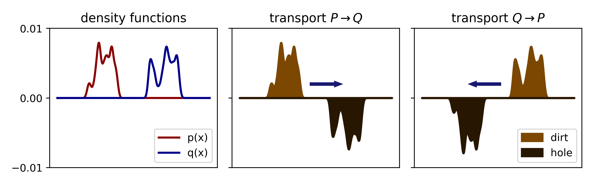
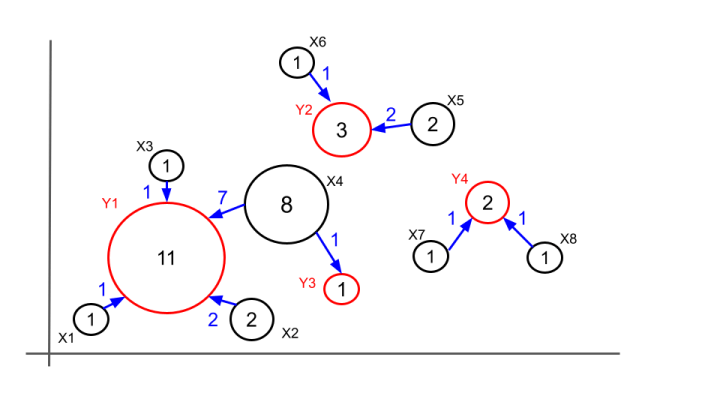

# Wasserstein-based DRO 基于 Wasserstein 距离的分布鲁棒优化

## 衡量分布间的距离

对于许多问题，我们知道随机变量的经验分布。即使并非如此，如果我们对于随机变量 $\xi$ 有 $N$ 个独立同分布的样本 $\xi_i$ ，也可以构造出经验分布。一种最方便的构造方式是：

$$\hat{\mathbb{P}_N}=\frac{1}{N}\sum_{i=1}^N \delta_{\hat{\xi_i}}$$

其中， $\delta_{\hat{\xi_i}}$ 是第 $i$ 个样本 $\hat{\xi_i}$ 的狄拉克（Dirac）点质量。

在构建模糊集的方式上，除了利用矩信息之外，另一种思路是衡量真实分布与经验分布之间的距离。在这种情况下，我们以经验分布为中心，将与经验分布不超过某一距离的所有分布纳入模糊集中。于是，如何定义两个概率分布间的距离成了关键，这一度量不仅需要有统计学意义，还应尽量让相应的分布鲁棒优化模型可处理。

## Wasserstein 度量

目前很受欢迎的一种度量方式是 Wasserstein 距离。设 $\mathbb{P}$ 和 $\mathbb{Q}$ 为可测空间 $(\Xi,\mathcal{B})$ 上的两个概率测度（分布），则它们之间的 Wasserstein 距离定义为：

$$W(\mathbb{P},\mathbb{Q})=\inf_{\Pi}\{\int_{\Xi \times \Xi} \mathbb{E}_{\Pi}[d(\xi,\xi')] \Pi(d\xi,d\xi'): \Pi(\Xi,d\xi')=\mathbb{P}(d\xi'), \Pi(d\xi,\Xi)=\mathbb{Q}(d\xi)\}$$

其中 $\Pi$ 为联合分布。如果把两个分布 $\mathbb{P}$ 和 $\mathbb{Q}$ 看作两个土堆，则 Wasserstein 距离可以视作为把一个分布搬运到另一个分布的成本（所以它也称作 earth mover's distance，动土距离），而式中的 $d(x,y)$ 则对应着成本函数。

特别地，在离散的情况下，Wasserstein 距离是把商品从一堆生产者运输到一堆需求者的最优传输距离。设 $\mathbb{P}=\sum_{i=1}^N p_i \delta_{\hat{\xi_i}}$ ， $\mathbb{Q}=\sum_{j=1}^M p_j \delta_{\hat{{\xi'}_j}}$ ，$\gamma_{ij}$ 为从 $i$ 到 $j$ 的运输计划， $c(i,j)$ 为从 $i$ 到 $j$ 的运输成本，则：

$$W(\mathbb{P},\mathbb{Q})=\inf_{\gamma_{ij}>0} \{ \sum_{ij} \gamma_{ij} · c(\xi_i,{\xi'}_j): \sum_j \gamma_{ij}=p_i, \forall i, \sum_i \gamma_{ij}=q_j, \forall j \}$$

有了 Wasserstein 距离，我们就可以定义一个 Wasserstein 球：

$$\mathbb{B}_\epsilon(\mathbb{Q}:W(\mathbb{Q},\mathbb{P}) \leq \epsilon)$$

## 分布鲁棒优化与机器学习

Wasserstein 距离近年来非常受欢迎的原因之一是其与机器学习中的许多问题存在着联系。

以逻辑回归问题为例，设 $x\in R^n$ 为输入向量， $y\in\{1,-1\}$ 为标签， $\beta$ 为回归参数，给定条件概率 $P(y \vert x)=(1+e^{-y·\beta^Tx})^{-1}$，若训练集中有 $N$ 个样本 $\xi_i=(x_i,y_i)$ ，则 $\beta$ 的极大似然估计为：

$$\hat{\beta}=\arg\min_\beta \frac{1}{N} \sum_{i=1}^N l_\beta(\xi_i)=\arg\min_\beta \mathbb{E}_{\hat{P_N}}[l_\beta(\xi)]$$

其中 $l_\beta(x,y)=\log (1+e^{-y·\beta^Tx})$ 为损失函数， $\hat{\mathbb{P}_N}$ 为经验分布。

不过，使用这种方式估计 $\beta$ 很容易出现过拟合的现象，导致 $\beta$ 的泛化能力较差，原因在于极大似然估计中所使用的经验分布 $\hat{\mathbb{P}_N}$ 来源于训练集，其与真实分布 $\mathbb{P}^*$ 之间存在差距。

在机器学习中，常用通过添加正则项的方式来提升泛化能力：

$$\hat{\beta}=\arg \min_\beta \mathbb{E}_{\hat{P_N}}[l_\beta(\xi)]+\epsilon R(\beta)$$

## 分布鲁棒线性规划

